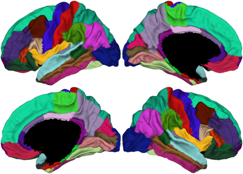
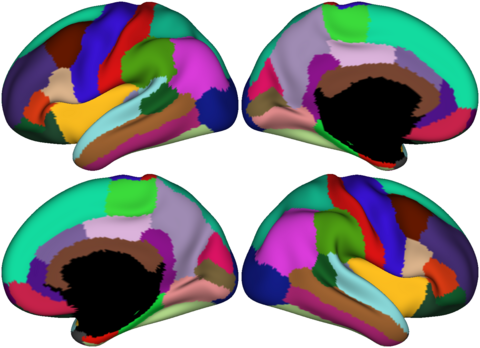

# brain_atlases

**This is WORK IN PROGRESS, do NOT use yet.**


Commonly used brain atlases in neuroimaging research, for the `fsaverage` and `fs_LR_32` templates.

This is a **community service** repository: it collects well-known cortical atlases and standard template surfaces in a convenient, ready-to-use form. The atlases are **the work of their respective authors** — we only distribute (and in some cases convert) them, so please respect the original authors and their licenses, listed for each atlas  in this repo (see `Attribution & citation` section below for details).

We have converted many atlases that are orginally available only for the `FS_LR_32` meshes to `fsaverage`, via resampling them in Connectome Workbench. You can inspect the workflow that was used in the scripts in the [dev_tools directory](./dev_tools/).

## Layout

| Path | Contents |
|---|---|
| `atlas_fsaverage/` | Atlases on the FreeSurfer `fsaverage` template (163,842 verts/hemi): HCP-MMP1, plus `aparc`, `aal3`, `brainnetome`, `schaefer100`–`schaefer1000` (resampled from `fs_LR` 32k). |
| `atlas_fs_LR_32/` | Atlases on the `fs_LR` 32k template (32,492 verts/hemi): `aparc`, `aal3`, `brainnetome`, `schaefer100`–`schaefer1000`. |
| `template_subject_meshes/` | Standard template surfaces: `fsaverage/` (FreeSurfer) and `fs_LR_32/` (DiedrichsenLab), plus `registration/` (HCP deformation spheres + cortex ROIs used for the fs_LR ↔ fsaverage resampling). |
| `dev_tools/` | Conversion scripts: `convert_fsLR32_to_fsaverage.sh` resamples the `fs_LR` 32k atlases to `fsaverage` using the HCP deformation spheres (needs Connectome Workbench + FreeSurfer + R), `visualize_all.R` renders all atlases with the headless scimesh backend, and `make_readme_previews.sh` builds the preview images shown in the [Gallery](#gallery) below. |

## Gallery

Full-resolution renders (4 views per atlas: lateral & medial of both hemispheres) of every atlas in this repo. Click any thumbnail to open the full-size image. The renders are produced by `dev_tools/visualize_all.R`; the previews by `dev_tools/make_readme_previews.sh`.

<details>
<summary><b>All fsaverage atlases at a glance (9)</b></summary>


</details>

<details>
<summary><b>All fs_LR 32k atlases at a glance (8)</b></summary>


</details>

### fsaverage template

| | | |
|---|---|---|
| [](dev_tools/visualize_all_output/fsaverage_HCPMMP1.png) | [](dev_tools/visualize_all_output/fsaverage_aparc.png) | [](dev_tools/visualize_all_output/fsaverage_aal3.png) |
| [](dev_tools/visualize_all_output/fsaverage_brainnetome.png) | [](dev_tools/visualize_all_output/fsaverage_schaefer100.png) | [](dev_tools/visualize_all_output/fsaverage_schaefer200.png) |
| [](dev_tools/visualize_all_output/fsaverage_schaefer300.png) | [](dev_tools/visualize_all_output/fsaverage_schaefer400.png) | [](dev_tools/visualize_all_output/fsaverage_schaefer1000.png) |

### fs_LR 32k template

| | | | |
|---|---|---|---|
| [](dev_tools/visualize_all_output/fsLR32_aparc.png) | [](dev_tools/visualize_all_output/fsLR32_aal3.png) | [](dev_tools/visualize_all_output/fsLR32_brainnetome.png) | [](dev_tools/visualize_all_output/fsLR32_schaefer100.png) |
| [](dev_tools/visualize_all_output/fsLR32_schaefer200.png) | [](dev_tools/visualize_all_output/fsLR32_schaefer300.png) | [](dev_tools/visualize_all_output/fsLR32_schaefer400.png) | [](dev_tools/visualize_all_output/fsLR32_schaefer1000.png) |

## Use as a FreeSurfer subjects dir

To use the fsaverage data directly with FreeSurfer / fsbrain (as `$SUBJECTS_DIR`), run the setup script once:

```sh
bash atlas_fsaverage/subjects_dir/rearrange_into_subjects_dir.sh
export SUBJECTS_DIR="$PWD/atlas_fsaverage/subjects_dir"
```

This copies the fsaverage meshes into `fsaverage/surf/` and the atlas `.annot` files into `fsaverage/label/`. The copies are **not** tracked in git (see `.gitignore`) — only the script is shipped.

## Attribution & citation

- Every atlas has a companion `.txt` file (e.g. `atlas_fs_LR_32/aparc.txt`) that records the **author(s), source, license, and citation DOI**. Please read it before using an atlas.
- **Cite the original papers** if you use any atlas in your work — the DOIs are listed in the `.txt` files. The atlases belong to their respective research groups; this repository merely redistributes them.
- Template meshes come from their respective sources; see `template_subject_meshes/fs_LR_32/fs_LR_32k.txt` for the `fs_LR_32` surfaces and `template_subject_meshes/fsaverage/fsaverage.txt` for the `fsaverage` surfaces.
