# brain_atlases


[](https://doi.org/10.5281/zenodo.22170381)


Commonly used cortical atlases in neuroimaging research, provided on the two standard human surface templates:

* **`fsaverage`** (FreeSurfer, 163,842 verts/hemi): `HCP-MMP1`, `aparc_conv`, `aal3`, `brainnetome`, `schaefer100`–`schaefer1000`
* **`fs_LR_32`** (conte69 / 32k, 32,492 verts/hemi): `aparc_conv`, `aal3`, `brainnetome`, `schaefer100`–`schaefer1000`

Most of these atlases are natively distributed only for the `fs_LR_32` mesh. The `fsaverage` versions in here were produced by the conversion pipeline in this repo: the `fs_LR_32` atlases are resampled to `fsaverage` with Connectome Workbench, using the HCP deformation spheres and medial-wall masking (reproducible via `dev_tools/convert_fsLR32_to_fsaverage.sh`).

The Glasser atlas (`HCP-MMP1`) is available for `fsaverage` thanks to the conversion done by Kathryn Mills, and only re-distributed here.

The atlases are **the work of their respective authors** — we only distribute (and in some cases convert) them, so please respect the original authors and their licenses, listed for each atlas in this repo (see [Attribution & citation](#attribution--citation) below).

## Layout

| Path | Contents |
|---|---|
| `atlas_fsaverage/` | Atlases on the FreeSurfer `fsaverage` template (163,842 verts/hemi): HCP-MMP1, plus `aparc_conv`, `aal3`, `brainnetome`, `schaefer100`–`schaefer1000` (resampled from `fs_LR` 32k). |
| `atlas_fs_LR_32/` | Atlases on the `fs_LR` 32k template (32,492 verts/hemi): `aparc_conv`, `aal3`, `brainnetome`, `schaefer100`–`schaefer1000`. |
| `template_subject_meshes/` | Standard template surfaces: `fsaverage/` (FreeSurfer) and `fs_LR_32/` (DiedrichsenLab), plus `registration/` (HCP deformation spheres + cortex ROIs used for the fs_LR ↔ fsaverage resampling). |
| `dev_tools/` | Conversion scripts: `convert_fsLR32_to_fsaverage.sh` resamples the `fs_LR` 32k atlases to `fsaverage` using the HCP deformation spheres (needs Connectome Workbench + FreeSurfer + R), `visualize_all.R` renders all atlases with the headless scimesh backend, `make_readme_previews.sh` builds the preview images shown in the [Gallery](#gallery) below, and `audit/audit_annots.R` audits all atlases (region counts, per-region CSV tables, provenance-driven) — see note below). |

> **Note on resampling lossiness:** the `fsaverage` versions of the atlases were resampled from `fs_LR` 32k with Connectome Workbench, which is lossy — tiny parcels can disappear during the resample. The only affected atlas is `schaefer1000`, whose right hemisphere has **498 instead of 500 parcels** on `fsaverage` (the `fs_LR` 32k version still has 499). Use `dev_tools/audit/audit_annots.R` to verify the region counts of all atlases.

## Usage

The atlases are stored as FreeSurfer annotation (`.annot`) files. Read them with the standard tool of your language:

* **R** — `freesurferformats::read.fs.annot("atlas_fs_LR_32/lh.aparc_conv.annot")`
* **Python** — `nibabel.freesurfer.read_annot("atlas_fs_LR_32/lh.aparc_conv.annot")`
* **MATLAB** — FreeSurfer's `read_annotation("atlas_fs_LR_32/lh.aparc_conv.annot")` (from `$FREESURFER_HOME/matlab/`)

The annots are per-hemisphere (`lh.*` / `rh.*`); use them together with the matching template surfaces in [`template_subject_meshes/`](./template_subject_meshes/).

## Gallery

Full-resolution renders (4 views per atlas: lateral & medial of both hemispheres) of every atlas in this repo. Click any thumbnail to open the full-size image. The renders are produced by `dev_tools/visualize_all.R`; the previews by `dev_tools/make_readme_previews.sh`.

<details>
<summary><b>All fsaverage atlases at a glance (9)</b></summary>

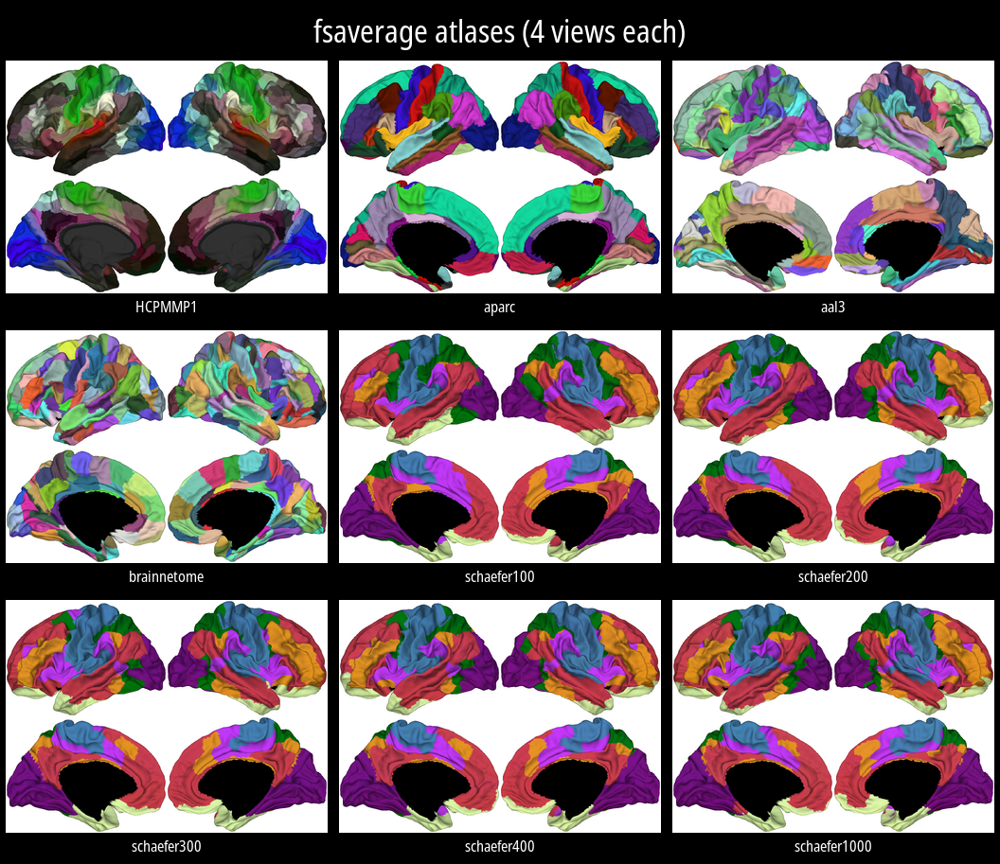

</details>

<details>
<summary><b>All fs_LR 32k atlases at a glance (8)</b></summary>

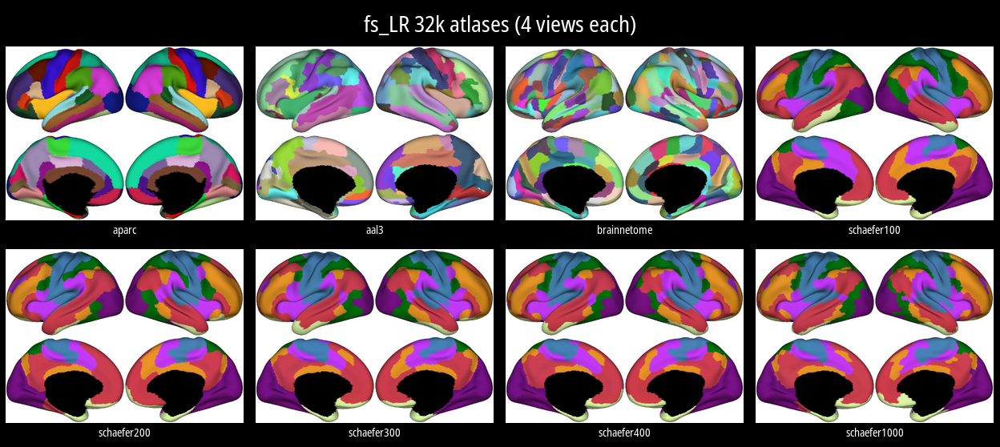

</details>


Visually, the different Schaefer variants look the same, but they of course do have different regions counts, as illustrated by [the output](./dev_tools/audit/output/audit_annots_output.txt) of our [audit script](./dev_tools/audit/audit_annots.R).

### fsaverage template

| | | |
|---|---|---|
| [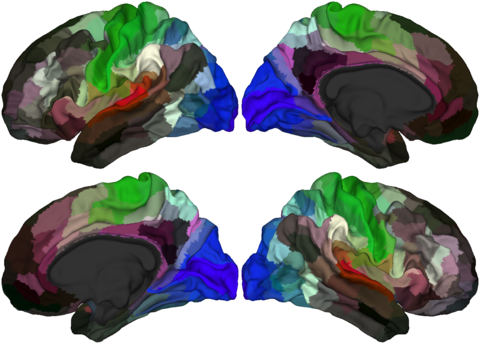](dev_tools/visualize_all_output/fsaverage_HCPMMP1.png) | [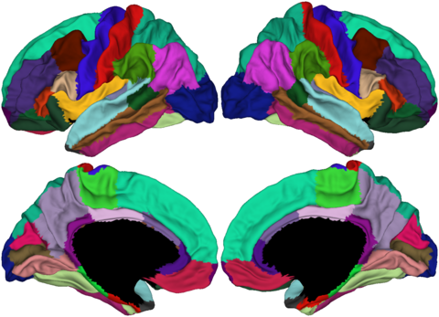](dev_tools/visualize_all_output/fsaverage_aparc_conv.png) | [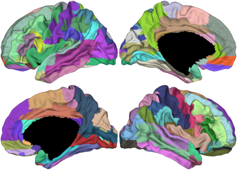](dev_tools/visualize_all_output/fsaverage_aal3.png) |
| [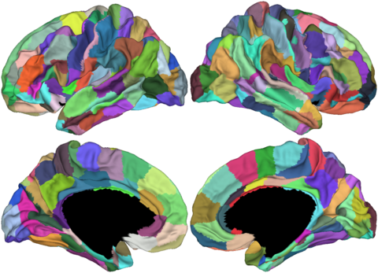](dev_tools/visualize_all_output/fsaverage_brainnetome.png) | [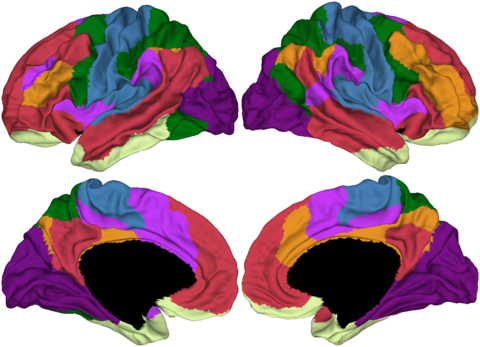](dev_tools/visualize_all_output/fsaverage_schaefer100.png) | [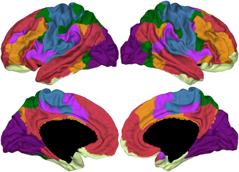](dev_tools/visualize_all_output/fsaverage_schaefer200.png) |
| [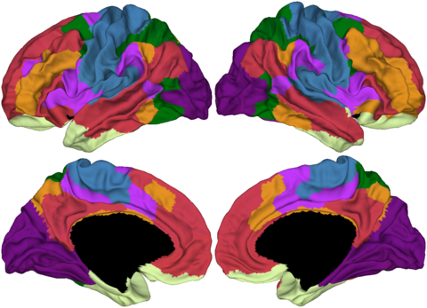](dev_tools/visualize_all_output/fsaverage_schaefer300.png) | [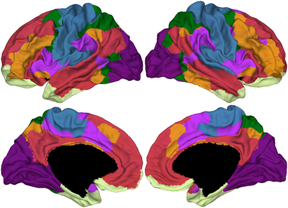](dev_tools/visualize_all_output/fsaverage_schaefer400.png) | [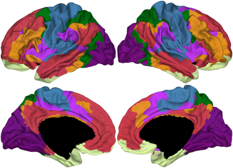](dev_tools/visualize_all_output/fsaverage_schaefer1000.png) |

### fs_LR 32k template

| | | | |
|---|---|---|---|
| [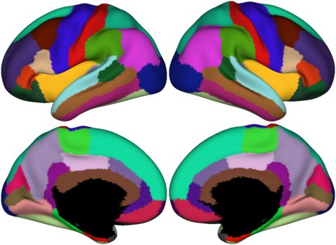](dev_tools/visualize_all_output/fsLR32_aparc_conv.png) | [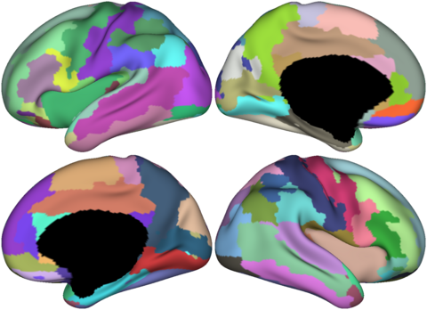](dev_tools/visualize_all_output/fsLR32_aal3.png) | [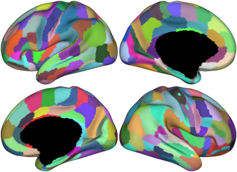](dev_tools/visualize_all_output/fsLR32_brainnetome.png) | [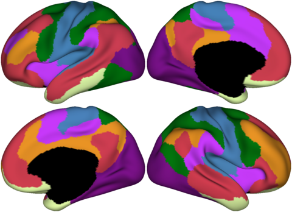](dev_tools/visualize_all_output/fsLR32_schaefer100.png) |
| [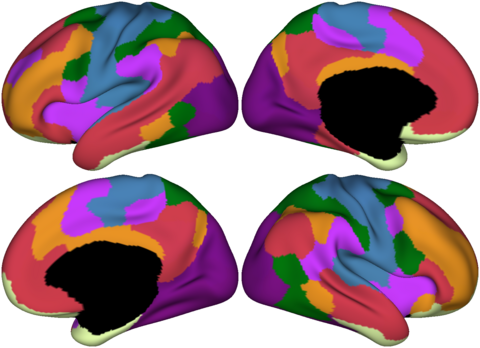](dev_tools/visualize_all_output/fsLR32_schaefer200.png) | [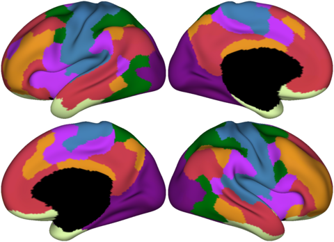](dev_tools/visualize_all_output/fsLR32_schaefer300.png) | [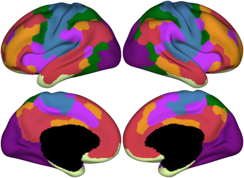](dev_tools/visualize_all_output/fsLR32_schaefer400.png) | [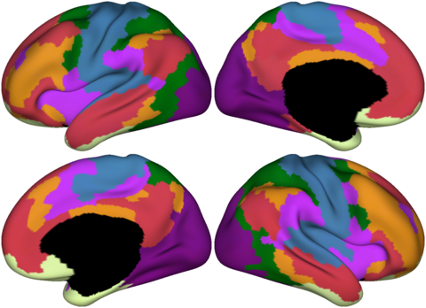](dev_tools/visualize_all_output/fsLR32_schaefer1000.png) |

## Audits and detailed per-atlas info

For every atlas in this repo you can inspect detailed per-region information — vertex counts on the mesh, color codes, usage flags, and (for the atlases we converted ourselves) the corresponding counts on the source mesh. This is generated by the audit script [`dev_tools/audit/audit_annots.R`](./dev_tools/audit/audit_annots.R):

* **Per-region tables** (one CSV per atlas, one row per region): [`dev_tools/audit/output/`](./dev_tools/audit/output/)
* **Atlas-level summary** (regions, vertices, mesh check): [`atlas_summary.csv`](./dev_tools/audit/output/atlas_summary.csv), also as a human-readable [`audit_annots_output.txt`](./dev_tools/audit/output/audit_annots_output.txt)

Run the audit yourself (needs R with `freesurferformats` and `jsonlite`):

```sh
Rscript dev_tools/audit/audit_annots.R
```

## Convert atlas layouts to a FreeSurfer subjects dir

To use the data directly with FreeSurfer / fsbrain (as `$SUBJECTS_DIR`), run the two copy scripts once:

```sh
bash dev_tools/rearrange_fsaverage_into_subjects_dir.sh
bash dev_tools/rearrange_fs_LR_32_into_subjects_dir.sh
export SUBJECTS_DIR="$PWD/subjects_dir"
```

The fsaverage script copies the fsaverage meshes into `subjects_dir/fsaverage/surf/` and the fsaverage atlas `.annot` files into `subjects_dir/fsaverage/label/`. The fs_LR_32 script does the same for the converted fs_LR 32k meshes (`surf/`) and the fs_LR 32k atlases (`label/`) under `subjects_dir/fs_LR_32/`. Both scripts also copy each dataset's `.attribution.json` and `.provenance.json` next to the data files they describe, and both subjects ship cortex labels (`lh/rh.cortex.label`) in `label/`. You can then copy this directory structure into your standard FreeSurfer subjects dir.

## Reproduction

All data was generated on **Ubuntu 24.04 LTS (x86_64)** with the following software:

| Software | Version |
|---|---|
| Connectome Workbench (`wb_command`) | 2.2.1 |
| FreeSurfer | 7.4.1 |
| R | 4.6.1 |
| R: `fsbrain` | 0.7.0 |
| R: `scimesh` | 0.3.4 |
| R: `freesurferformats` | 1.0.1 |
| ImageMagick (`montage`/`convert`) | 6.9.12 |
| Python: `yabplot` (fs_LR 32k atlas download) | 0.5.1 |
| Python: `neuromaps` (HCP registration spheres/ROIs) | 0.0.7 |

The `fs_LR` 32k atlases, template meshes, and HCP registration data are already included in this repo, so no downloads are needed to reproduce the derived files. Run, in this order:

```sh
# 1. Resample the fs_LR 32k atlases to fsaverage (needs wb_command + FreeSurfer + R)
bash dev_tools/convert_fsLR32_to_fsaverage.sh

# 2. Materialize the FreeSurfer subjects_dir layout (used by step 3)
#    (both subjects: fsaverage and fs_LR_32)
bash dev_tools/rearrange_fsaverage_into_subjects_dir.sh
bash dev_tools/rearrange_fs_LR_32_into_subjects_dir.sh

# 3. Render all atlases as 4-view PNGs (needs R: fsbrain 0.7.0 + scimesh 0.3.4; visualize_all.R pins these versions)
Rscript dev_tools/visualize_all.R

# 4. Build the README preview images (needs ImageMagick)
bash dev_tools/make_readme_previews.sh
```

Strictly speaking you only need step 1 to get the atlases. The rest if validation / presentation only.


The HCP-MMP1 atlas was obtained separately from the Human Connectome Project (see `atlas_fsaverage/HCPMMP1.txt`). It is not generated by the pipeline, this repo only re-distributes it.


## Atlases shipping with FreeSurfer

We do not provide atlases for fsaverage that come with FreeSurfer, just use them from your FreeSurfer installation:

In `$FREESURFER_HOME/subjects/fsaverage/label/` you will find e.g.:

* the Desikan–Killiany atlas (`lh/rh.aparc.annot`)
* the Destrieux atlas (`lh/rh.aparc.a2009s.annot`), and
* the Yeo et al. (2011) functional parcellations (`lh/rh.Yeo2011_7Networks_N1000.annot` and `lh/rh.Yeo2011_17Networks_N1000.annot`).

Note that the `aparc_conv` atlas in this repo (in both `atlas_fsaverage/` and `atlas_fs_LR_32/`) is the Desikan–Killiany atlas, converted from the fs_LR_32 version for development/comparison purposes only. We do not recommend to use it. Use the one that comes with FreeSurfer. It is deliberately named `aparc_conv` (not `aparc`) so it can never be confused with, or accidentally overwrite, FreeSurfer's own `aparc`.


## Attribution & citation

- Every atlas (and template mesh) has a companion `.attribution.json` file (e.g. `atlas_fs_LR_32/aparc_conv.attribution.json`) that records the **author(s), source, license, and citation DOI**. Please read it before using an atlas. The technical provenance of each file (where it came from, how it was produced, checksums) is recorded in a matching `.provenance.json` file.
- **Cite the original papers** if you use any atlas in your work — the DOIs are listed in the `.attribution.json` files. The atlases belong to their respective research groups; this repository merely redistributes them.
- Template meshes come from their respective sources; see `template_subject_meshes/fs_LR_32/fs_LR_32k.attribution.json` for the `fs_LR_32` surfaces and `template_subject_meshes/fsaverage/fsaverage.attribution.json` for the `fsaverage` surfaces.


## Author and License

The scripts in this repo were written by, and the conversions performed by [Tim Schäfer](https://ts.rcmd.org).

We consider the atlases in converted formats a derivative work, so each converted atlas is under the license of the original one, of course. Once more, see the `.attribution.json` files mentioned in the `Attribution & citation` section for each atlas.

If you desperately need to know a license for the conversion scripts, basically the stuff under [dev_tools/](./dev_tools/), I license these under the very permissive [MIT license](https://opensource.org/license/mit).

